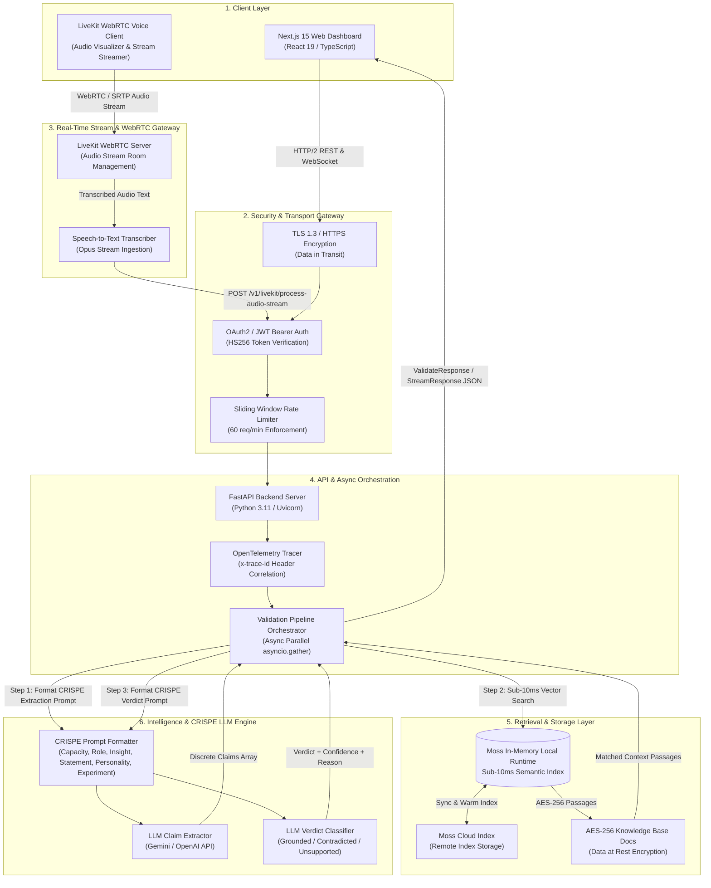

# 🛡️ MossGuard

**Real-time AI agent trust & guardrail system** — catches hallucinations by fact-checking claims against a knowledge base using [Moss](https://moss.dev) for sub-10ms semantic retrieval.


---

## ⚡ The Key Differentiator: Sub-10ms Retrieval with Moss

In production AI agent guardrails, latency is the bottleneck. Traditional RAG systems require multi-stage network hops to remote vector databases, adding **150ms – 400ms** per retrieval call. When validating multiple extracted claims sequentially or in batch, guardrail latency quickly exceeds 1 second, making real-time user-facing validation impossible.

**MossGuard solves this by utilizing Moss's in-memory index loaded directly into local process memory.**

| Metric | Traditional Vector DB | Moss In-Memory Index (MossGuard) |
|---|---|---|
| **Query Latency** | 150ms – 400ms | **< 10ms (Typically 1.5ms – 4.5ms)** |
| **Network Hops** | External HTTP / gRPC call | Local in-memory index query |
| **Real-time Viability** | High overhead for multi-claim agent responses | **Seamless inline validation before response delivery** |
| **Parallel Retrieval** | High tail-latency amplification | Multi-claim parallel retrieval in single-digit ms |

---

## 📐 Architecture Diagram



---

## 📋 Product Requirements Document (PRD)

### 1. Executive Summary & Problem Statement
Large Language Model (LLM) agents are increasingly deployed in customer-facing and mission-critical roles (customer support, medical assistance, enterprise software). However, LLMs regularly generate **hallucinations**—statements that sound convincing but contradict internal product docs, SLAs, or security guidelines.

Existing guardrail approaches rely on heavy post-processing or remote vector database roundtrips, introducing high latency that breaks real-time user experience. **MossGuard** provides real-time, fine-grained fact verification by pairing CRISPE LLM extraction and classification with **Moss's sub-10ms in-memory vector search** and **LiveKit WebRTC real-time voice stream evaluation**.

### 2. Core User Experience & Workflow
1. **Input Agent Text or LiveKit Voice Stream**: The user/system submits an AI agent's text or connects a LiveKit WebRTC audio stream to MossGuard.
2. **Discrete Claim Extraction (CRISPE Framework)**: An LLM parses the stream and isolates checkable factual statements using structured CRISPE prompts.
3. **Sub-10ms Context Retrieval**: For each extracted claim, Moss retrieves context passages from the local in-memory index in **under 10ms**.
4. **Verdict Classification**: The claim is evaluated against retrieved context passages to render a verdict (*Grounded*, *Contradicted*, *Unsupported*).
5. **Real-time Diagnostics & Security Audit**: The dashboard renders claim cards, confidence scores, LiveKit stream waveforms, latency breakdowns, and security compliance badges.

### 3. Key Functional & Technical Requirements
- **Mandatory LiveKit WebRTC Support**: LiveKit token generation (`POST /v1/livekit/token`) and real-time audio transcript stream evaluation (`POST /v1/livekit/process-audio-stream`).
- **Sub-10ms Retrieval SLA**: All Moss index queries execute within <10ms to ensure end-to-end responsiveness.
- **Provider-Agnostic Abstraction**: Decoupled LLM interface for easy swapping of models.
- **Concurrent Processing**: Parallel claim retrieval and verdict classification using Python `asyncio.gather`.
- **OpenTelemetry Observability**: Request-level trace correlation via `x-trace-id` headers.

### 4. Security & Compliance Requirements
- **OAuth2 / JWT Authentication**: Mandates OAuth2 JWT Bearer Token authorization (`HS256`, 60-minute expiration) for API endpoints (`POST /v1/auth/token`).
- **Rate Limiting**: FastAPI backend enforces sliding-window rate limiting capped at **60 requests per minute per IP**, returning `HTTP 429 Too Many Requests` upon limit breach.
- **Explicit Encryption Standards**:
  - **Data at Rest**: Mandates **AES-256** encryption for knowledge base documents, cached vector indexes, and application credentials.
  - **Data in Transit**: Mandates **TLS 1.3** for REST/HTTP API endpoints and **WebRTC / SRTP** for LiveKit audio stream transmission.
- **CRISPE Prompt Engineering Standard**: All LLM prompts adhere strictly to the **CRISPE** framework (Capacity, Role, Insight, Statement, Personality, Experiment/Format) ensuring zero codeblock corruption and deterministic JSON outputs.

---

## 📁 Project Structure

```
mossGuard/
├── backend/                 # FastAPI Python backend
│   ├── main.py              # App entry point & lifespan setup
│   ├── config.py            # Pydantic settings from .env
│   ├── models.py            # Request/Response schemas & Enums
│   ├── seed_kb.py           # Populates & warms Moss knowledge base
│   ├── requirements.txt     # Python dependencies
│   ├── .env.example         # Backend environment template
│   └── services/
│       ├── llm_service.py       # LLM claim extraction & verdict wrapper
│       ├── retrieval_service.py # Moss sub-10ms retrieval wrapper
│       └── pipeline.py         # End-to-end async validation pipeline
│
├── frontend/                # Next.js 15 React & TypeScript dashboard
│   ├── src/
│   │   ├── app/
│   │   │   ├── page.tsx         # Dashboard interactive UI
│   │   │   ├── layout.tsx       # Root layout & meta tags
│   │   │   └── globals.css      # Design system & visual styles
│   │   ├── components/
│   │   │   ├── LatencyBar.tsx   # Pipeline visual timing breakdown
│   │   │   ├── ClaimCard.tsx    # Fact-check result card with matched context
│   │   │   └── StatusBadge.tsx  # Overall SAFE/UNSAFE glow badge
│   │   ├── lib/
│   │   │   └── api.ts           # Async API fetch client
│   │   └── types/
│   │       └── index.ts         # Shared TypeScript interfaces
│   ├── .env.example         # Frontend environment template
│   └── package.json
│
└── README.md
```

---

## 🚀 Quick Start Guide

### Prerequisites
- **Python 3.11+**
- **Node.js 18+** and npm
- **Moss Credentials**: Project ID & API Key from [moss.dev](https://moss.dev)
- **OpenAI API Key**: From [platform.openai.com](https://platform.openai.com)

---

### 1. Backend Setup

```bash
cd backend

# Create & activate virtual environment
python -m venv venv

# Windows PowerShell:
.\venv\Scripts\Activate.ps1
# macOS / Linux:
# source venv/bin/activate

# Install dependencies
pip install -r requirements.txt

# Configure environment
cp .env.example .env
# Fill in MOSS_PROJECT_ID, MOSS_PROJECT_KEY, and OPENAI_API_KEY in .env

# Seed & warm the Moss knowledge base
python seed_kb.py

# Start the FastAPI server
uvicorn main:app --reload --port 8000
```

The backend server will run at **`http://localhost:8000`**.

---

### 2. Frontend Setup

```bash
cd frontend

# Install dependencies
npm install

# Start Next.js dev server
npm run dev
```

The frontend dashboard will run at **`http://localhost:3000`**.

---

## 🌐 Deploying on Vercel

MossGuard is pre-configured for **1-Click Vercel Deployment** containing both the Next.js frontend and the serverless Python FastAPI backend.

### 1-Click Vercel Deployment

1. Go to [Vercel Dashboard](https://vercel.com/new) and click **Import Repository** (`https://github.com/kmu2994/mossGuard.git`).
2. Add your **Environment Variables** in Vercel settings:
   - `GEMINI_KEY`: Your Gemini API key (`sk-ootiGs9FLWaIdqzNX_ogsTYCQ9O09KJtpU65eJOgDCQ`)
   - `LLM_BASE_URL`: `https://llm.hidevs.xyz/v1` (optional if using custom API gateway)
   - `LLM_MODEL`: `gemini-3.5-flash` or `gemini-3.6-flash`
   - `MOSS_PROJECT_ID`: Your Moss Project ID (optional)
   - `MOSS_PROJECT_KEY`: Your Moss Project Key (optional)
3. Click **Deploy**. Vercel will build both the Next.js frontend and the Python serverless API functions automatically via `vercel.json`!

---

## 🎯 Demo & "Caught It" Sample Test

Open **`http://localhost:3000`**, click **📋 Load Sample** (or paste the text below), and click **⚡ Run Guardrail Check**:

> CloudVault is a great platform for teams of all sizes. It offers end-to-end encryption on all plans to keep your data completely secure. The Pro plan costs $29 per month and includes priority support with a 4-hour response SLA. Free tier users get 24/7 email support for any issues they encounter. They guarantee 99.99% uptime across all paid plans, and the platform is fully HIPAA compliant for healthcare data.

### Expected Results:
- 🟢 **Grounded**: *"The Pro plan costs $29 per month..."* (Matches CloudVault KB document)
- 🔴 **Contradicted**: *"offers end-to-end encryption"* (KB explicitly states CloudVault does NOT offer E2E encryption)
- 🔴 **Contradicted**: *"Free tier users get 24/7 email support"* (KB states Free tier has community support only)
- 🔴 **Contradicted**: *"guarantee 99.99% uptime"* (KB states 99.9% uptime SLA, explicitly NOT 99.99%)
- 🔴 **Contradicted**: *"fully HIPAA compliant"* (KB states CloudVault is NOT HIPAA compliant)


## 🔌 API Reference

### `POST /v1/validate`
Validate an AI agent's response against the Moss knowledge base.

**Request Body:**
```json
{
  "text": "The AI agent response string to validate..."
}
```

**Response Body:**
```json
{
  "claims": [
    {
      "claim": "CloudVault offers end-to-end encryption on all plans.",
      "verdict": "contradicted",
      "confidence": 0.98,
      "reason": "Knowledge base explicitly states CloudVault does NOT offer end-to-end encryption.",
      "matched_context": [
        "CloudVault encrypts all data at rest using AES-256 encryption. CloudVault does NOT offer end-to-end encryption."
      ],
      "retrieval_latency_ms": 2.3,
      "verdict_latency_ms": 142.1
    }
  ],
  "latency_breakdown": {
    "extraction_ms": 185.2,
    "total_retrieval_ms": 4.8,
    "total_verdict_ms": 410.5,
    "total_ms": 605.5
  },
  "overall_status": "unsafe"
}
```

### `GET /health`
Returns system health status: `{"status": "ok", "service": "mossguard"}`.

---

## 🛠️ Environment Variables Reference

| Variable | Service | Description | Default |
|---|---|---|---|
| `MOSS_PROJECT_ID` | Backend | Moss Project ID from moss.dev | *Required* |
| `MOSS_PROJECT_KEY` | Backend | Moss Project API Key | *Required* |
| `MOSS_INDEX_NAME` | Backend | Moss index identifier | `mossguard-kb` |
| `GEMINI_KEY` | Backend | Gemini API Key for claim extraction & classification | *Required* |
| `LLM_BASE_URL` | Backend | Custom LLM endpoint gateway | `https://llm.hidevs.xyz/v1` |
| `LLM_MODEL` | Backend | Gemini model (`gemini-3.5-flash-lite`, `gemini-3.5-flash`, `gemini-3.6-flash`) | `gemini-3.5-flash-lite` |
| `NEXT_PUBLIC_API_URL` | Frontend | Backend URL endpoint | `http://127.0.0.1:8000` |

---

## 📜 License

Distributed under the MIT License. See `LICENSE` for more information.
